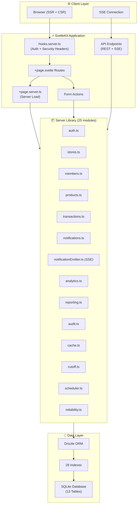
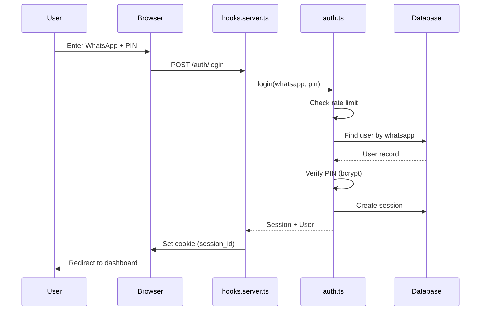
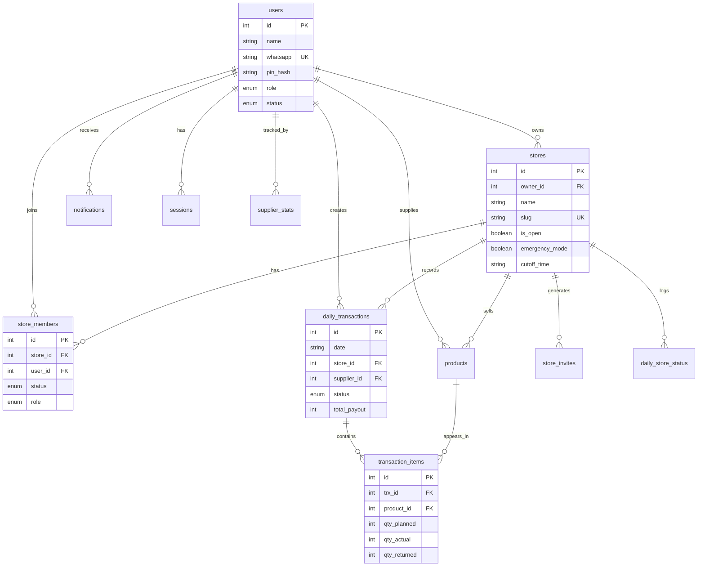
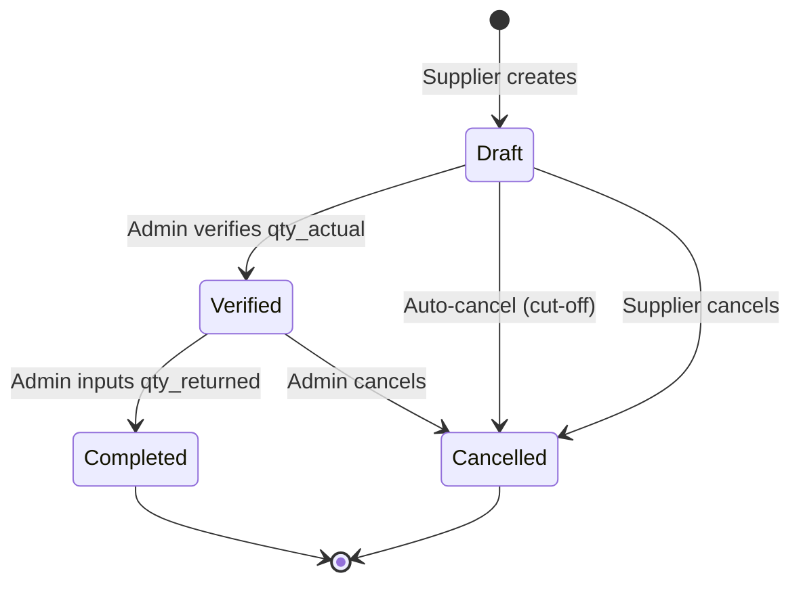
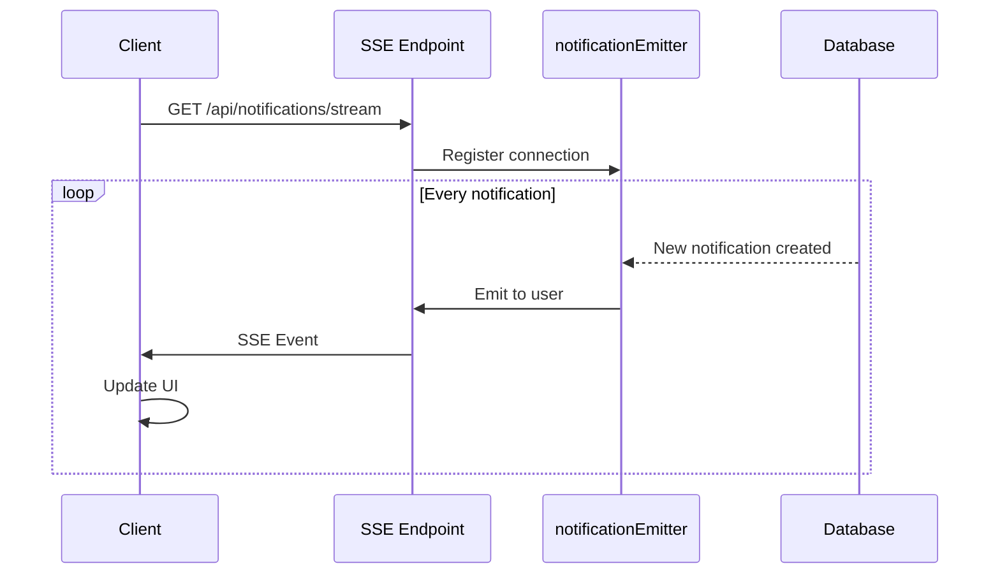

# 🏗️ Architecture Overview

> **Project:** Mak Unyil - Konsinyasi Digital
> **Stack:** SvelteKit 5, TypeScript, SQLite/Drizzle ORM
> **Last Updated:** 7 Januari 2026

---

## 📊 System Architecture



---

## 📁 Directory Structure

```
src/
├── lib/
│   ├── components/          # UI Components (14 files)
│   │   ├── ui/              # shadcn-svelte base (6)
│   │   ├── ErrorBoundary.svelte
│   │   ├── LoadingSpinner.svelte
│   │   ├── LoadingStates.svelte
│   │   ├── ServerClock.svelte
│   │   ├── SetoranModal.svelte
│   │   ├── Skeleton.svelte
│   │   ├── ThemeToggle.svelte
│   │   └── index.ts
│   │
│   ├── server/              # Server-side logic (25 modules)
│   │   ├── db/              # Database (4 files)
│   │   │   ├── schema.ts    # 13 tables
│   │   │   ├── indexes.ts   # 28 indexes
│   │   │   ├── index.ts     # Connection
│   │   │   └── seed.ts      # Seeding
│   │   │
│   │   ├── auth.ts          # Authentication
│   │   ├── stores.ts        # Store CRUD
│   │   ├── members.ts       # Membership
│   │   ├── products.ts      # Products
│   │   ├── transactions.ts  # Transactions
│   │   ├── notifications.ts # Notifications
│   │   ├── notificationEmitter.ts  # SSE
│   │   ├── invites.ts       # Invite codes
│   │   ├── analytics.ts     # Dashboard
│   │   ├── reporting.ts     # Reports
│   │   ├── reliability.ts   # Supplier stats
│   │   ├── audit.ts         # Audit logging
│   │   ├── cache.ts         # In-memory cache
│   │   ├── cutoff.ts        # Cut-off logic
│   │   ├── scheduler.ts     # Scheduling
│   │   ├── storeStatus.ts   # Status history
│   │   ├── sanitize.ts      # Input sanitization
│   │   ├── rateLimit.ts     # In-memory rate limit
│   │   ├── rateLimitPersistent.ts  # SQLite rate limit
│   │   ├── featureFlags.ts  # Feature toggles
│   │   ├── imageOptimization.ts
│   │   ├── config.ts        # Config validation
│   │   ├── errors.ts        # Custom errors
│   │   ├── logger.ts        # Logging
│   │   └── index.ts         # Barrel exports
│   │
│   ├── schemas/             # Zod validation schemas
│   ├── types/               # TypeScript types (branded)
│   └── utils.ts             # Client utilities
│
├── routes/
│   ├── admin/               # Owner panel (47 files)
│   │   ├── stores/[id]/     # Per-store management
│   │   │   ├── analytics/
│   │   │   ├── audit-log/

│   │   │   ├── invite/
│   │   │   ├── members/
│   │   │   ├── products/
│   │   │   ├── reliability/
│   │   │   ├── reports/
│   │   │   ├── return/
│   │   │   ├── settings/
│   │   │   └── validation/
│   │   └── ...
│   │
│   ├── app/                 # Supplier panel (33 files)
│   │   ├── discover/
│   │   ├── history/
│   │   ├── join/
│   │   ├── notifications/
│   │   ├── products/
│   │   ├── setor/
│   │   └── stores/
│   │
│   ├── api/                 # API endpoints
│   │   ├── cron/cutoff/     # Cron webhook
│   │   ├── notifications/stream/  # SSE
│   │   ├── scheduler/
│   │   └── stores/
│   │
│   ├── auth/                # Authentication
│   │   ├── login/
│   │   ├── logout/
│   │   ├── register/
│   │   └── reset-pin/
│   │
│   └── join/                # Invite flow
│       └── [code]/
│
└── tests/                   # 11 test files (77+ tests)
```

---

## 🔐 Authentication Flow



---

## 💎 Data Model



---

## 🔄 Transaction Status Flow



---

## 📡 Real-time Notifications (SSE)



---

## ⚡ Performance Optimizations

| Layer | Optimization |
|-------|-------------|
| Database | 28 indexes on frequently queried columns |
| Cache | In-memory with stale-while-revalidate pattern |
| Bundle | Code splitting per route, vendor chunks |
| Images | Lazy loading, WebP conversion hints |
| Queries | Batch operations, N+1 prevention |

---

## 🔒 Security Measures

| Measure | Implementation |
|---------|---------------|
| Authentication | Bcrypt PIN hashing (cost factor 12) |
| Session | HTTP-only cookies, 30-day expiry |
| Rate Limiting | SQLite persistent + memory fallback |
| Headers | CSP, X-Frame-Options, HSTS, X-Content-Type-Options |
| Input | Zod validation, HTML sanitization |
| CSRF | SvelteKit built-in protection |

---

## 🧪 Testing Strategy

| Type | Coverage | Tool |
|------|----------|------|
| Unit Tests | 77+ tests | Vitest |
| Schema Tests | Zod validation | Vitest + Zod |
| E2E Tests | User flows | Playwright |
| Type Safety | Compile-time | TypeScript strict |

---

## 📊 Metrics

| Metric | Value |
|--------|-------|
| Server Modules | 25 |
| Database Tables | 13 |
| Database Indexes | 28 |
| Route Files | 100+ |
| Test Files | 11 |
| Unit Tests | 77+ |
| Notification Types | 15 |
| Audit Actions | 12 |

---

*Architecture documentation maintained by the development team*
*Last Updated: 7 Januari 2026*
