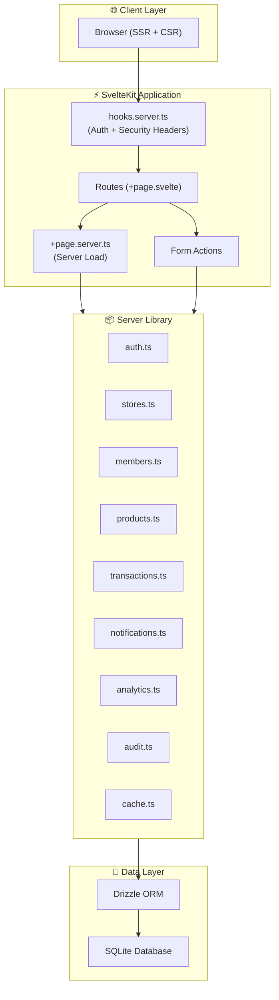
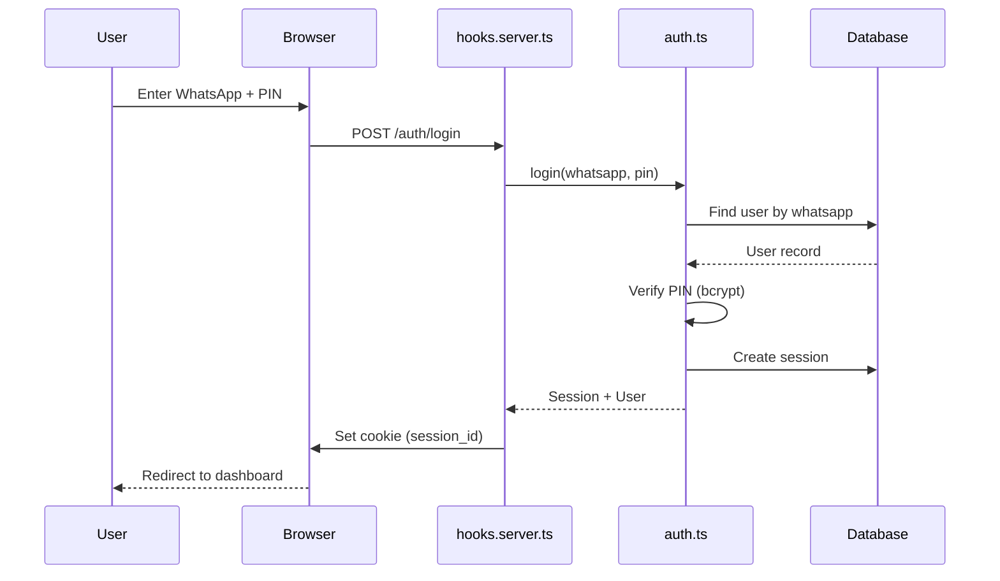
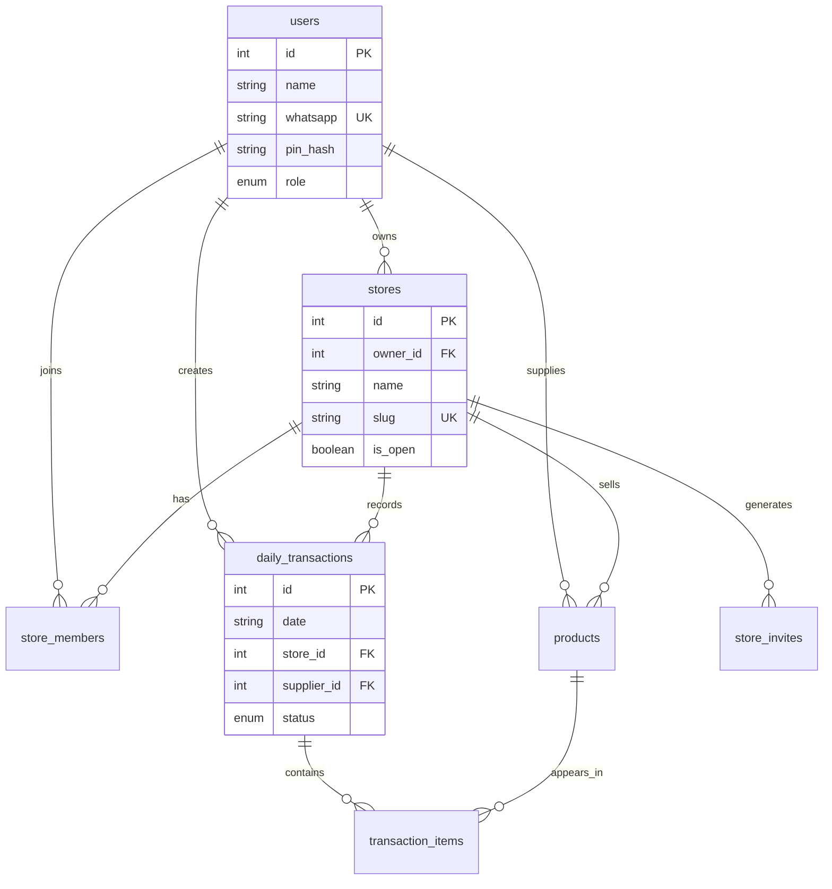
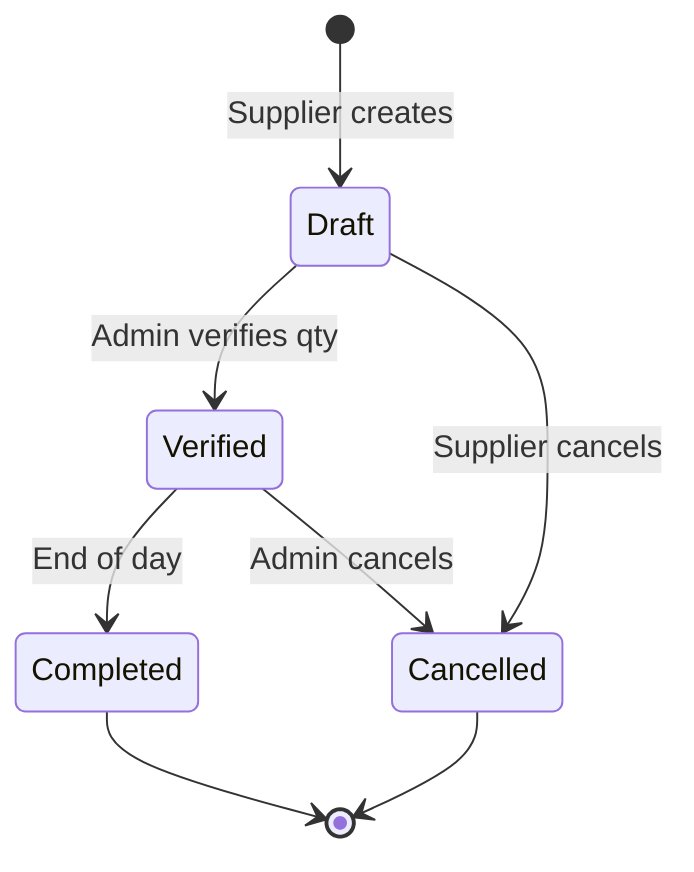

# 🏗️ Architecture Overview

> **Project:** Mak Unyil - Konsinyasi Digital
> **Stack:** SvelteKit 5, TypeScript, SQLite/Drizzle ORM

---

## 📊 System Architecture



---

## 📁 Directory Structure

```
src/
├── lib/
│   ├── components/          # UI Components
│   │   ├── ui/              # shadcn-svelte base
│   │   ├── Skeleton.svelte  # Loading states
│   │   ├── ErrorBoundary.svelte
│   │   └── index.ts         # Barrel exports
│   │
│   ├── server/              # Server-side logic
│   │   ├── db/              # Database schema & indexes
│   │   ├── auth.ts          # Authentication
│   │   ├── stores.ts        # Store management
│   │   ├── transactions.ts  # Transaction CRUD
│   │   ├── cache.ts         # In-memory caching
│   │   ├── featureFlags.ts  # Feature toggles
│   │   └── index.ts         # Barrel exports
│   │
│   ├── schemas/             # Zod validation schemas
│   ├── types/               # TypeScript types (branded)
│   └── utils.ts             # Client utilities
│
├── routes/
│   ├── admin/               # Owner panel
│   ├── app/                 # Supplier panel
│   ├── auth/                # Authentication pages
│   └── join/                # Invite flow
│
└── tests/                   # Vitest unit tests
```

---

## 🔐 Authentication Flow



---

## 💎 Data Model



---

## 🔄 Transaction Status Flow



---

## ⚡ Performance Optimizations

| Layer | Optimization |
|-------|-------------|
| Database | 28 indexes on frequently queried columns |
| Cache | In-memory with stale-while-revalidate |
| Bundle | Code splitting per route, vendor chunks |
| Images | Lazy loading, WebP conversion hints |

---

## 🔒 Security Measures

| Measure | Implementation |
|---------|---------------|
| Authentication | Bcrypt PIN hashing |
| Session | HTTP-only cookies, 30-day expiry |
| Headers | CSP, X-Frame-Options, HSTS |
| Input | Zod validation, HTML sanitization |
| Rate Limiting | Login attempt limits (persistent) |

---

## 🧪 Testing Strategy

| Type | Coverage | Tool |
|------|----------|------|
| Unit Tests | Core logic | Vitest |
| Schema Tests | Validation | Vitest + Zod |
| Type Safety | Compile-time | TypeScript strict |

---

*Documentation maintained by the development team*
