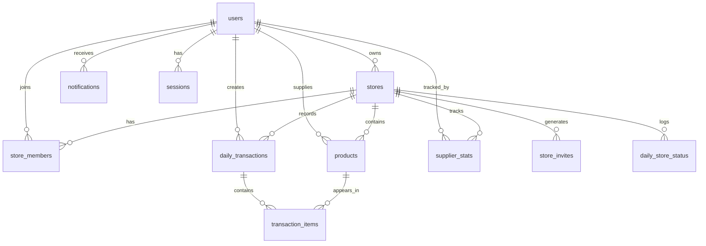

# 📦 Project Breakdown: Mak Unyil - Konsinyasi Digital

> **Tanggal Analisis:** 7 Januari 2026
> **Versi:** 1.0.0-production
> **Status:** Production Ready ✅

---

## 🎯 Ringkasan Eksekutif

**Mak Unyil** adalah platform konsinyasi digital multi-tenant yang menghubungkan pemilik lapak (Owner) dengan penyetor/supplier. Platform ini memungkinkan pengelolaan produk titip-jual dengan sistem setoran harian, tracking penjualan, dan transparansi penuh.

### Objectives Tercapai
- ✅ Sistem konsinyasi semi-digital dengan nota hybrid
- ✅ Multi-lapak per owner dan supplier
- ✅ Approval workflow untuk produk dan member
- ✅ Real-time notifications via SSE
- ✅ Audit trail lengkap
- ✅ Analytics dan reliability tracking
- ✅ Cut-off time dengan auto-cancel

---

## 📊 Technology Stack

| Layer | Technology | Versi |
|-------|------------|-------|
| **Framework** | SvelteKit | 5.x (SSR) |
| **UI Runtime** | Svelte 5 | Runes-based |
| **Language** | TypeScript | 5.x |
| **Styling** | TailwindCSS | 4.x |
| **UI Library** | shadcn-svelte + bits-ui | Latest |
| **Icons** | Lucide Svelte | 0.469.0 |
| **Database** | SQLite (better-sqlite3) | 11.x |
| **ORM** | Drizzle ORM | 0.38.x |
| **Validation** | Zod | 4.x |
| **Testing** | Vitest + Playwright | 4.x / 1.57.x |
| **Real-time** | sveltekit-sse | 0.14.x |
| **Toast** | svelte-sonner | 0.3.x |

---

## 🗄️ Database Schema

### Tables Overview (12 Tables)



### Table Details

| # | Table | Deskripsi | Kolom Kunci |
|---|-------|-----------|-------------|
| 1 | `users` | Akun pengguna | role (owner/supplier), status, whatsapp |
| 2 | `sessions` | Session autentikasi | userId, expiresAt |
| 3 | `stores` | Data lapak | visibility, isOpen, autoApprove, cutoffTime |
| 4 | `store_invites` | Kode undangan | code, expiresAt, maxUses, usedCount |
| 5 | `store_members` | Relasi member | status, role (member/admin), rejectedAt |
| 7 | `products` | Katalog produk | priceBuy, priceSell, suggestedPriceSell |
| 8 | `daily_transactions` | Header transaksi | date, status, totalPayout, notePhotoUrl |
| 9 | `transaction_items` | Item transaksi | qtyPlanned, qtyActual, qtyReturned |
| 10 | `notifications` | Notifikasi in-app | type (15 types), isRead |
| 11 | `audit_logs` | Audit trail | entityType, action (12 types), oldValue/newValue |
| 12 | `daily_store_status` | History status lapak | wasOpen, emergencyClose |
| 13 | `rate_limits` | Rate limiting | key, count, resetTime |
| 14 | `supplier_stats` | Statistik supplier | reliabilityScore, averageAccuracy |

---

## 📁 Project Structure

```
src/
├── app.css                    # Global styles (TailwindCSS 4)
├── app.html                   # HTML template
├── app.d.ts                   # Type declarations
├── hooks.server.ts            # Auth & security middleware
│
├── lib/
│   ├── components/            # 8 custom + ui folder
│   │   ├── ui/                # shadcn-svelte base (6 components)
│   │   ├── ErrorBoundary.svelte
│   │   ├── LoadingSpinner.svelte
│   │   ├── LoadingStates.svelte
│   │   ├── ServerClock.svelte
│   │   ├── SetoranModal.svelte
│   │   ├── Skeleton.svelte
│   │   ├── ThemeToggle.svelte
│   │   └── index.ts
│   │
│   ├── server/                # 25 server modules
│   │   ├── db/
│   │   │   ├── schema.ts      # 12 tables + types
│   │   │   ├── indexes.ts     # 28 database indexes
│   │   │   ├── index.ts       # DB connection
│   │   │   └── seed.ts        # Seeding script
│   │   │
│   │   ├── auth.ts            # Authentication (login, register, session)
│   │   ├── stores.ts          # Store CRUD
│   │   ├── members.ts         # Membership management
│   │   ├── products.ts        # Product CRUD + approval
│   │   ├── transactions.ts    # Transaction flow
│   │   ├── notifications.ts   # Notification CRUD
│   │   ├── notificationEmitter.ts  # SSE emitter
│   │   ├── invites.ts         # Invite codes
│   │   ├── analytics.ts       # Dashboard data
│   │   ├── reporting.ts       # Report generation
│   │   ├── reliability.ts     # Supplier reliability
│   │   ├── audit.ts           # Audit logging
│   │   ├── cache.ts           # In-memory cache
│   │   ├── cutoff.ts          # Cut-off processing
│   │   ├── scheduler.ts       # Task scheduling
│   │   ├── storeStatus.ts     # Store status logging
│   │   ├── sanitize.ts        # Input sanitization
│   │   ├── rateLimit.ts       # In-memory rate limiter
│   │   ├── rateLimitPersistent.ts  # SQLite rate limiter
│   │   ├── featureFlags.ts    # Feature toggles
│   │   ├── imageOptimization.ts    # Image helpers
│   │   ├── config.ts          # Config validation
│   │   ├── errors.ts          # Custom error classes
│   │   ├── logger.ts          # Logging utility
│   │   └── index.ts           # Barrel exports
│   │
│   ├── schemas/               # Zod validation schemas
│   ├── types/                 # TypeScript types (branded)
│   └── utils.ts               # Client utilities
│
├── routes/
│   ├── +layout.server.ts      # Root layout data
│   ├── +layout.svelte         # Root layout
│   ├── +page.svelte           # Landing page
│   │
│   ├── admin/                 # Owner panel (47 files)
│   │   ├── +layout.svelte     # Admin sidebar layout
│   │   ├── +page.svelte       # Dashboard
│   │   ├── stores/[id]/       # Per-store management
│   │   │   ├── analytics/
│   │   │   ├── audit-log/

│   │   │   ├── invite/
│   │   │   ├── members/
│   │   │   ├── products/
│   │   │   ├── reliability/
│   │   │   ├── reports/
│   │   │   ├── return/
│   │   │   ├── settings/
│   │   │   └── validation/
│   │   ├── members/
│   │   ├── notifications/
│   │   ├── products/
│   │   ├── reports/
│   │   ├── settings/
│   │   └── transactions/
│   │
│   ├── app/                   # Supplier panel (33 files)
│   │   ├── +layout.svelte     # Supplier sidebar layout
│   │   ├── +page.svelte       # Dashboard
│   │   ├── [storeId]/         # Per-store context
│   │   │   └── setor/
│   │   ├── discover/
│   │   ├── history/
│   │   ├── join/
│   │   ├── notifications/
│   │   ├── products/
│   │   ├── setor/
│   │   └── stores/
│   │
│   ├── api/                   # API endpoints (7 files)
│   │   ├── cron/cutoff/       # Cron endpoint
│   │   ├── notifications/stream/  # SSE endpoint
│   │   ├── scheduler/         # Scheduler API
│   │   └── stores/            # REST API
│   │
│   ├── auth/                  # Authentication (8 files)
│   │   ├── login/
│   │   ├── logout/
│   │   ├── register/
│   │   └── reset-pin/
│   │
│   └── join/                  # Invite flow (2 files)
│       └── [code]/
│
└── tests/                     # 11 test files
    ├── batchQueries.test.ts
    ├── cutoff.test.ts
    ├── errors.test.ts
    ├── perfectScore.test.ts
    ├── phase2.test.ts
    ├── phase4-7.test.ts
    ├── rateLimit.test.ts
    ├── schemas.test.ts
    ├── sse-notifications.test.ts
    ├── transactions.test.ts
    └── setup.ts
```

---

## 🔐 Fitur Keamanan

| Fitur | Implementasi |
|-------|--------------|
| Password Hashing | bcrypt |
| Session Management | HTTP-only cookies, 30-day expiry |
| Rate Limiting | SQLite-persistent + in-memory fallback |
| Input Validation | Zod schemas |
| Input Sanitization | HTML escaping, XSS prevention |
| Security Headers | CSP, X-Frame-Options, HSTS |
| CSRF Protection | SvelteKit built-in |

---

## 📈 Fitur Utama

### Authentication
- Login dengan WhatsApp + PIN
- Register dengan role selection
- Reset PIN
- Session dengan auto-expiry

### Store Management
- CRUD lapak dengan slug unik
- Toggle buka/tutup + emergency mode
- Visibility (public/private)
- Auto-approve settings
- Operating hours configuration
- Cut-off time settings

### Membership
- Join via invite code atau request
- Approval workflow (pending → active)
- Rejection dengan cooldown 7 hari
- Admin role untuk delegasi
- Leave request dengan approval

### Products
- CRUD dengan image upload
- Suggested price dari supplier
- Final price dari owner
- Approval workflow
- Status toggle

### Transactions
- Status flow: Draft → Verified → Completed
- Qty: planned → actual → returned
- Payout calculation
- Export CSV
- Auto-cancel via cut-off

### Notifications
- 15 notification types
- Real-time via SSE
- Mark as read
- Notification center

### Analytics & Reporting
- Dashboard dengan revenue chart
- Weekly/monthly reports
- CSV export
- Supplier reliability scores

### Audit Trail
- 12 action types
- JSON diff tracking
- IP address logging
- UI viewer

---

## 🧪 Testing

| Type | Count | Framework |
|------|-------|-----------|
| Unit Tests | 77+ | Vitest |
| E2E Tests | ✅ | Playwright |
| Schema Tests | ✅ | Vitest + Zod |

### Test Files
- `rateLimit.test.ts` - Rate limiter logic
- `schemas.test.ts` - Zod schema validation
- `batchQueries.test.ts` - Sanitization & batch
- `phase2.test.ts` - Phase 2 features
- `phase4-7.test.ts` - Scheduler, cutoff, PDF export
- `sse-notifications.test.ts` - SSE real-time
- `perfectScore.test.ts` - Code quality tests
- `errors.test.ts` - Error handling
- `cutoff.test.ts` - Cut-off logic
- `transactions.test.ts` - Transaction logic

---

## 🚀 Scripts

```bash
# Development
npm run dev           # Start dev server

# Build
npm run build         # Production build
npm run preview       # Preview production

# Testing
npm run test          # Watch mode
npm run test:run      # Run once
npm run test:coverage # With coverage
npm run test:e2e      # Playwright E2E

# Code Quality
npm run lint          # ESLint
npm run lint:fix      # Auto-fix
npm run format        # Prettier
npm run check         # Svelte check

# Database
npm run db:push       # Apply schema
npm run db:studio     # Drizzle Studio
npm run db:seed       # Seed data
```

---

## 📊 Metrics

| Metric | Value |
|--------|-------|
| Server Modules | 25 |
| Database Tables | 12 |
| Route Files | 100+ |
| Test Files | 11 |
| Unit Tests | 77+ |
| Custom Components | 8 |
| UI Components | 6 |
| Notification Types | 15 |
| Audit Actions | 12 |
| Database Indexes | 28 |

---

## ✅ Completion Status

| Phase | Status |
|-------|--------|
| Phase 0: Bugfix & Stabilisasi | ✅ Complete |
| Phase 1: MVP Enhancement | ✅ Complete |
| Phase 2: Production Ready | ✅ Complete |
| Phase 3: Scale & Advanced | ✅ Complete (except WhatsApp & PWA) |

**Overall Completion: ~99%**

---

*Dokumen ini di-generate otomatis pada 7 Januari 2026*
