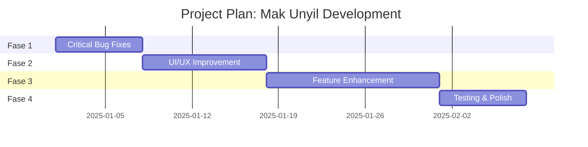

# Project Plan: Mak Unyil - Konsinyasi Digital

> Roadmap pengembangan berdasarkan analisis komprehensif project

---

## 📋 Executive Summary

Project plan ini dirancang untuk menyelesaikan **bug kritis**, meningkatkan **UI/UX**, dan menambah **fitur baru** secara bertahap. Dibagi menjadi **4 fase** dengan estimasi total **6-8 minggu** untuk developer tunggal.

---

## 🎯 Fase & Timeline Overview



---

## 🔴 Fase 1: Critical Bug Fixes (Minggu 1)

> [!CAUTION]
> Prioritas tertinggi - harus selesai sebelum lanjut ke fase berikutnya

### 1.1 Fix Fungsi Setoran Produk
**Estimasi:** 2-3 hari

| Task | File Target | Deskripsi |
|------|-------------|-----------|
| Debug setor flow | `/app/[storeId]/setor/` | Identifikasi dan fix bug input setoran |
| Fix transaction creation | `/api/stores/[storeId]/transactions/` | Pastikan draft → verified → completed works |
| Fix qty calculation | `transaction_items` | qty_planned, qty_actual, qty_returned |

### 1.2 Image Management untuk Produk
**Estimasi:** 2 hari

| Task | File Target | Deskripsi |
|------|-------------|-----------|
| Display gambar produk | `/app/[storeId]/products/` | Tampilkan preview gambar |
| Delete gambar | `/api/upload/` | Endpoint delete file |
| Replace gambar | Product form | Update dengan gambar baru |

### 1.3 Fix Komunitas Lokal
**Estimasi:** 1 hari

| Task | File Target | Deskripsi |
|------|-------------|-----------|
| Restrict posting | `/api/community/local/` | Hanya owner store yang bisa post |
| Member only comment | `/app/[storeId]/community/` | Hide create post button untuk member |

### 1.4 Deliverables Fase 1
- [ ] Fungsi setor berjalan end-to-end
- [ ] Gambar produk bisa ditampilkan, dihapus, diganti
- [ ] Komunitas lokal: owner post, member comment only

---

## 🟡 Fase 2: UI/UX Improvement (Minggu 2-3)

### 2.1 Redesign Landing Page
**Estimasi:** 2-3 hari

| Task | Deskripsi |
|------|-----------|
| Hero section modern | Gradient background, CTA buttons |
| Feature showcase | Cards dengan icons |
| Testimonial/stats section | Social proof |
| Mobile responsive | Mobile-first design |

### 2.2 Migrasi ke shadcn-svelte
**Estimasi:** 3-4 hari

| Area | Status | Action |
|------|--------|--------|
| Auth pages | ⚠️ Partial | Complete migration |
| Owner dashboard | ⚠️ Partial | Replace custom components |
| Supplier (app) pages | ⚠️ Partial | Standardize all forms/tables |
| Public store pages | ⚠️ Partial | Use Card, Button, Badge |

### 2.3 Penerapan Tema Rose
**Estimasi:** 1-2 hari

| Task | Deskripsi |
|------|-----------|
| Audit `app.css` | Pastikan variabel tema konsisten |
| Dark mode toggle | Verifikasi semua halaman support dark |
| Color consistency | Primary, secondary, accent colors |

### 2.4 Improve Supplier Pages
**Estimasi:** 2 hari

| Page | Improvement |
|------|-------------|
| `/app` Dashboard | Better store cards, stats overview |
| `/app/[storeId]/setor` | Cleaner form, better UX |
| `/app/[storeId]/products` | Grid view, better image handling |
| `/app/[storeId]/history` | Sortable table, filters |

### 2.5 Deliverables Fase 2
- [ ] Landing page modern dan menarik
- [ ] Semua halaman menggunakan shadcn-svelte
- [ ] Tema Rose konsisten (dark/light)
- [ ] Halaman supplier lebih user-friendly

---

## 🟢 Fase 3: Feature Enhancement (Minggu 4-5)

### 3.1 Analytics Dashboard
**Estimasi:** 3-4 hari

| Feature | Role | Deskripsi |
|---------|------|-----------|
| Sales chart | Owner | Grafik penjualan harian/mingguan |
| Top products | Owner | Produk terlaris |
| Earnings summary | Supplier | Total pendapatan per periode |
| Store performance | Owner | Perbandingan performance per cabang |

### 3.2 Export Report
**Estimasi:** 2 hari

| Feature | Library | Output |
|---------|---------|--------|
| Transaction report | `xlsx` (sudah installed) | Excel file |
| Product list | `xlsx` | Excel file |
| Member list | `xlsx` | Excel file |

### 3.3 Enhanced Notification
**Estimasi:** 2 hari

| Feature | Deskripsi |
|---------|-----------|
| Real-time notification | SSE sudah ada, enhance UI |
| Notification center | Badge count, mark as read |
| Email notification | Optional trigger |

### 3.4 Store Discovery Enhancement
**Estimasi:** 2 hari

| Feature | Deskripsi |
|---------|-----------|
| Search & filter | Cari lapak by name, location |
| Store rating | Basic rating system |
| Store categories | Kategorisasi lapak |

### 3.5 Deliverables Fase 3
- [ ] Dashboard analytics dengan charts
- [ ] Export ke Excel untuk transaksi dan produk
- [ ] Notification system yang lebih baik
- [ ] Store discovery yang lebih powerful

---

## 🔵 Fase 4: Testing & Polish (Minggu 6)

### 4.1 Automated Testing
**Estimasi:** 2-3 hari

| Type | Tool | Coverage |
|------|------|----------|
| Unit tests | Vitest | Utils, auth functions |
| Integration tests | Vitest | API endpoints |
| E2E tests | Playwright | Critical user flows |

### 4.2 Performance Optimization
**Estimasi:** 1-2 hari

| Area | Action |
|------|--------|
| Image optimization | Compress uploads, lazy loading |
| Database queries | Add indexes, optimize joins |
| Bundle size | Code splitting, dynamic imports |

### 4.3 Documentation
**Estimasi:** 1 hari

| Doc | Content |
|-----|---------|
| API docs | Endpoint documentation |
| User guide | Panduan penggunaan |
| Deployment guide | Production setup |

### 4.4 Deliverables Fase 4
- [ ] Test coverage minimal 60%
- [ ] Lighthouse score > 80
- [ ] Documentation lengkap

---

## 📊 Priority Matrix

```
                    IMPACT
            Low         High
        ┌───────────┬───────────┐
   Low  │ Store     │ Analytics │
        │ Discovery │ Export    │
EFFORT  ├───────────┼───────────┤
        │ Theme     │ Setor Fix │
  High  │ Polish    │ Image Mgmt│
        └───────────┴───────────┘

Legend:
🔴 Do First (High Impact, Low Effort): Theme, Komunitas Fix
🟡 Schedule (High Impact, High Effort): Setor Fix, Image Mgmt, UI Redesign
🟢 Quick Wins (Low Impact, Low Effort): Store Discovery
🔵 Consider Later (Low Impact, High Effort): Full Test Coverage
```

---

## 🗓️ Weekly Milestones

| Minggu | Fase | Milestone | Deliverable |
|--------|------|-----------|-------------|
| 1 | Fase 1 | Critical Fixes | Setor works, images managed, community fixed |
| 2 | Fase 2 | UI Foundation | Landing page redesign, theme applied |
| 3 | Fase 2 | UI Complete | All pages use shadcn, responsive |
| 4 | Fase 3 | Analytics | Dashboard charts, export reports |
| 5 | Fase 3 | Features | Notifications, store discovery |
| 6 | Fase 4 | Quality | Tests, optimization, docs |

---

## ⚡ Quick Start: First 3 Tasks

Untuk memulai segera, fokus pada 3 task pertama:

### Task 1: Fix Setoran Flow
```
Target: /src/routes/app/[storeId]/setor/
Goal: Input setor → Save as draft → Owner validate
```

### Task 2: Image Preview & Delete
```
Target: /src/routes/api/upload/ & product forms
Goal: Display, delete, replace product images
```

### Task 3: Local Community Restriction
```
Target: /src/routes/api/community/local/
Goal: Only store owner can create posts
```

---

## 📝 Notes & Considerations

> [!IMPORTANT]
> - Semua estimasi berdasarkan single developer
> - Waktu bisa berkurang jika parallel development
> - Setiap fase harus di-test sebelum lanjut

> [!TIP]
> Gunakan branching strategy:
> - `main` - production ready
> - `develop` - integration branch
> - `feature/*` - per-feature branch
> - `fix/*` - bug fix branch

---

*Project Plan dibuat pada: 2025-12-29*
